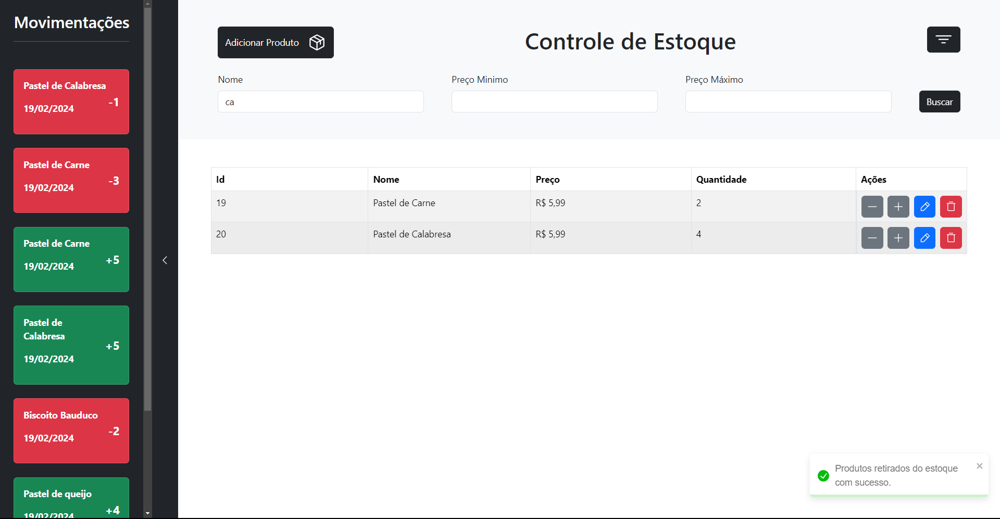
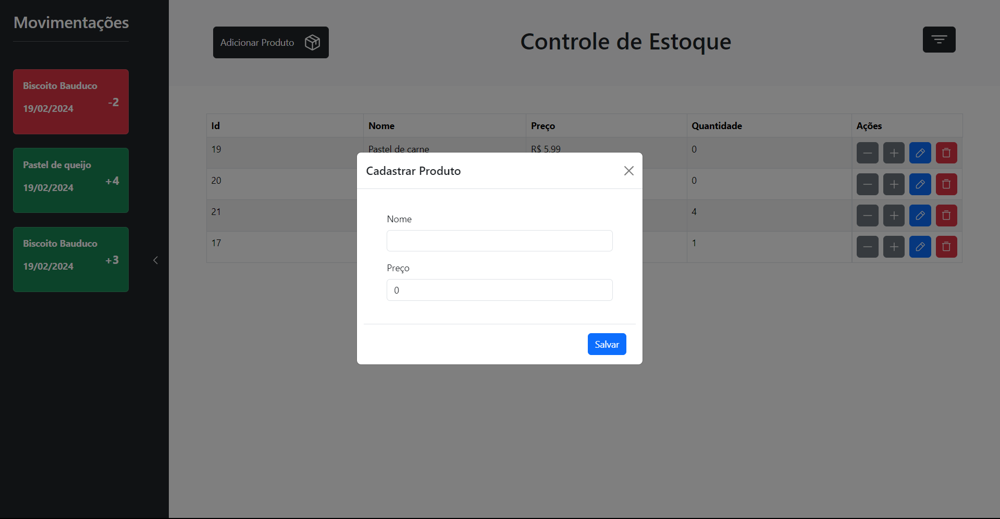
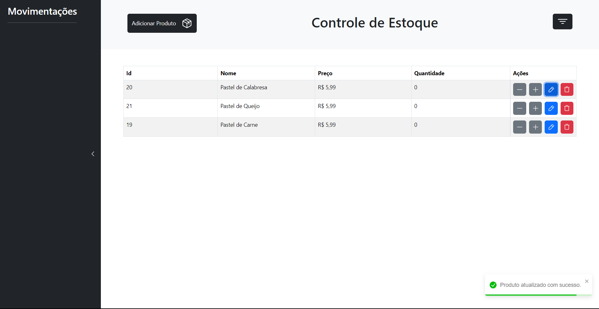

# 💵 Stock Control

Stock control is a project to manage products stocks and control the history of input and output of their quantities

⸻

## ⚙️ Tech Stack

| Layer      | Tech                              |
|------------|-----------------------------------|
| Backend    | Python, FastAPI, SQLModel        |
| Frontend   | Typescript, React, Bootstrap, React Hook Form, React Query |
| Database   | PostgreSQL (via Docker)   |
| DevOps  | Docker, GitHub Actions |
| Lint  | ESLint |

⸻

## 🚀 Features
- 🛒 Product management with create, update and delete. 
- 🧰 Stock history with inputs and outputs of product quantities
- 💻 Simple and intuitive UI 
- 🐳 Dockerized development environment

⸻

## 📂 Project Structure

<pre>

```
stock-control
├── client/                # React App
│   ├── src/           
│   │   ├── app/           # App Routing
│   │   ├── components/    # Global Components
│   │   ├── lib/           # Lib Modules
│   │   ├── services/      # App Services
│   │   └── main.tsx       # React Entrypoint
│   └── .env.exemple       # Env Variables Exemple
│
├── server/                # FastAPI APP
│   ├── migrations/        # Database Migrations   
│   ├── api/               # Api Module
│   │   ├── controllers/   # Endpoints Definition 
│   │   ├── models/        # App Entities and Schemas
│   │   ├── repositories/  # App Repositories
│   │   ├── services/      # App Services
│   │   ├── __init__.py    # Python Module Init File     
│   │   ├── db.py          # Database Config
│   │   └── main.py        # FastAPI Entrypoint
│   └── .env.exemple       # Env Variables Exemple
│
├── .github/               # CI Config
├── docker-compose.yml			
└── README.md
```
</pre>

⸻

## 🪟 App Preview





⸻

## 🚀 Getting Started

### 📦 Requirements
	• Python 3.10+
	• Node.js 20+
	• Docker & Docker Compose

⸻

## 🐳 Start with Docker

### Build and run everything

`docker-compose up --build`

Access the frontend at http://localhost:5173.

You also can access the backend API docs at http://localhost:8080/docs.

⸻

<!-- ## 🧪 Run Tests

Backend tests (pytest):

- cd server
- uv sync
- uv run pytest -->
